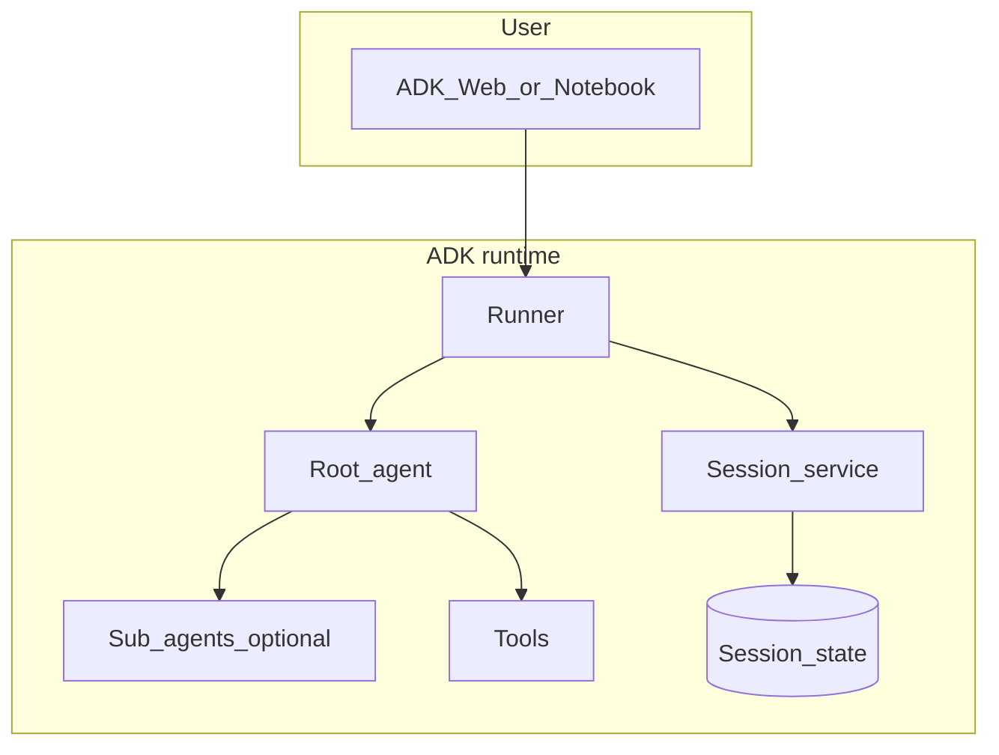
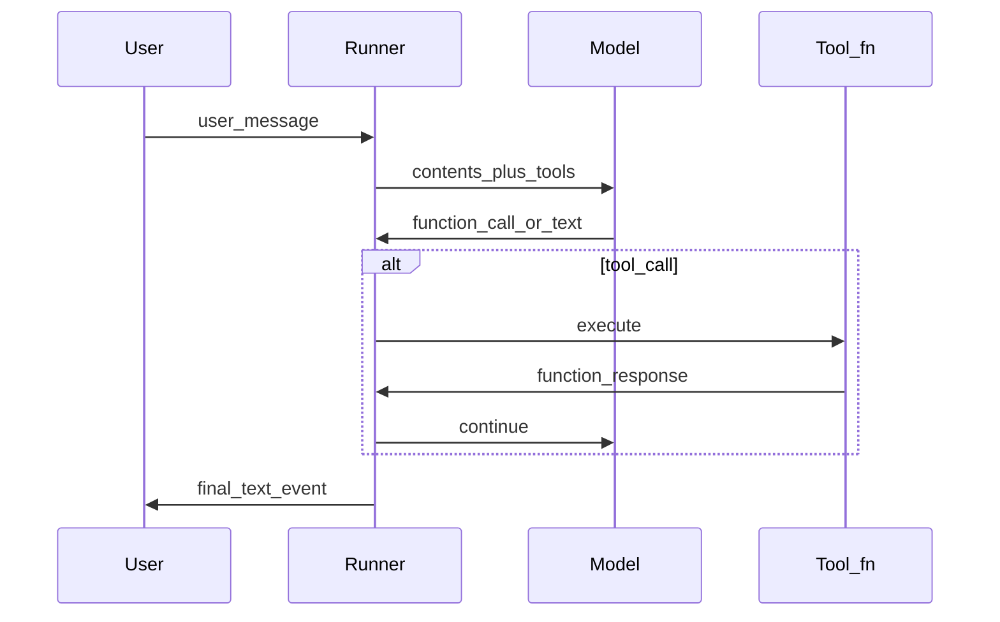
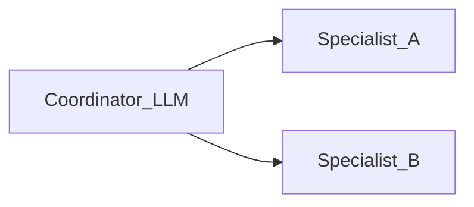
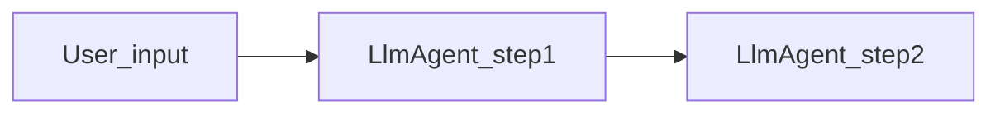
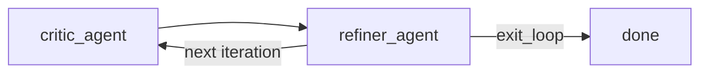
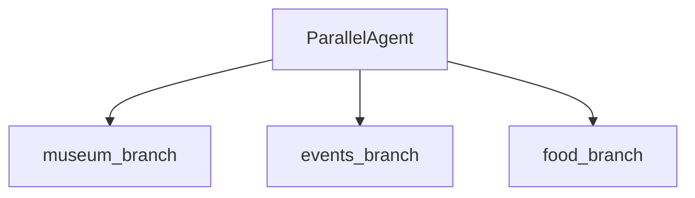
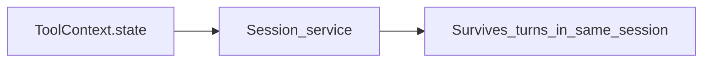

# ADK architecture (workshop cheat sheet)

These diagrams summarize concepts used in [`demos/`](demos/) and the [official docs](https://google.github.io/adk-docs/).

## Components at runtime

- **Runner:** Executes an invocation: streams **Events** (model text, tool calls, tool results).
- **Agent:** Instructions + model + optional `tools` and `sub_agents`.
- **Session service:** Persists conversation and **session state** (for example keys your tools set via `ToolContext.state`).

## Single-agent request flow

## Multi-agent delegation

The coordinator’s model decides **which sub-agent** should act, using ADK’s multi-agent orchestration (see [`11-multi_agent_coordinator`](demos/11-multi_agent_coordinator/agent.py)).

## Sequential pipeline (fixed order)

`SequentialAgent` runs each child **in list order**—no LLM routing between stages (see [`07-sequential_pipeline`](demos/07-sequential_pipeline/agent.py)). Use this when workflow order must be deterministic.

## LoopAgent (iterate until exit)

`LoopAgent` repeats its `sub_agents` until someone sets **`escalate`** (e.g. via the **`exit_loop`** tool) or `max_iterations` is hit. Workshop example: [`16-loop_plan_refine`](demos/16-loop_plan_refine/agent.py). Full narrative: [`ADK_Learning_tool_multi_agents.ipynb`](notebooks/ADK_Learning_tool_multi_agents.ipynb).

## ParallelAgent (concurrent branches)

Branches run **concurrently**; each child can write **`output_key`** values into shared state for a later **synthesis** agent. Workshop example: [`17-parallel_research_synth`](demos/17-parallel_research_synth/agent.py).

## Session memory vs model context

What you store in `tool_context.state` in a tool is available on later turns **for that session**—distinct from simply hoping the model recalls earlier chat text.

## Curriculum order

For a guided path from beginner demos to advanced ones, see [`CURRICULUM.md`](CURRICULUM.md).

## Where to go next

- Tool confirmation (HITL): [adk-docs tools confirmation](https://google.github.io/adk-docs/tools/confirmation/)
- Deployment: [adk-docs deploy](https://google.github.io/adk-docs/deploy/)
- Extra samples: [google/adk-samples](https://github.com/google/adk-samples)
