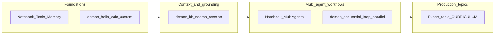

# ADK course path: beginner → expert

Use a **virtual environment** for every path ([`README.md`](README.md)). Official codelab context: [ADK Crash Course (Google Codelabs)](https://codelabs.developers.google.com/onramp/instructions#0).

This document ties together **two notebook tracks** and **`demos/`** so you can teach a full arc in one day or split across sessions.

---

## Course map



---

## Module 1 — Foundations (beginner)

**Concepts:** `Agent`, instructions, tools, docstrings → schemas, first **`adk web`** session.

| Step | Resource | Practice |
|------|----------|----------|
| 1.1 | [`notebooks/ADK_Learning_tools_venv.ipynb`](notebooks/ADK_Learning_tools_venv.ipynb) | Part 0–1: imports, day trip agent, `Runner` |
| 1.2 | [`demos/01-hello_web`](demos/01-hello_web) | Chat-only agent in Web UI |
| 1.3 | [`demos/02-calculator_basics`](demos/02-calculator_basics) | Tool chaining |
| 1.4 | [`demos/03-custom_tools`](demos/03-custom_tools) | Structured tool results / errors |

**Colab original (optional):** [`ADK_Learning_tools.ipynb`](ADK_Learning_tools.ipynb) — align with codelab *Session 1–2*.

---

## Module 2 — Context & grounding (intermediate)

**Concepts:** retrieval-shaped tools, **`google_search`**, **`ToolContext.state`**, `SequentialAgent` (simple pipeline).

| Step | Resource | Practice |
|------|----------|----------|
| 2.1 | [`demos/04-static_kb_rag`](demos/04-static_kb_rag) | Ground answers in snippet tool |
| 2.2 | [`demos/05-day_trip_search`](demos/05-day_trip_search) | Built-in search tool |
| 2.3 | [`notebooks/ADK_Learning_tools_venv.ipynb`](notebooks/ADK_Learning_tools_venv.ipynb) | Part 3: memory / same session |
| 2.4 | [`demos/06-session_memory`](demos/06-session_memory) | State across turns in Web UI |
| 2.5 | [`demos/07-sequential_pipeline`](demos/07-sequential_pipeline) | Two-step **ordered** LLM pipeline |
| 2.6 | [`demos/08-sequential_state_shared`](demos/08-sequential_state_shared) | Same session **`output_key`** pattern as the multi-agent notebook foodie flow |
| 2.7 | [`demos/09-live_weather_nws`](demos/09-live_weather_nws) | Tooling **without** `google_search` (HTTP to NWS) |
| 2.8 | [`demos/10-agent_config_yaml`](demos/10-agent_config_yaml) | Same dice/prime idea as samples, loaded from **`root_agent.yaml`** |

**Colab / codelab alignment:** *Session 4 (memory)* in the [Codelab guide](https://codelabs.developers.google.com/onramp/instructions#0).

---

## Module 3 — Multi-agent orchestration (advanced → expert)

**Primary notebook:** [`notebooks/ADK_Learning_tool_multi_agents.ipynb`](notebooks/ADK_Learning_tool_multi_agents.ipynb)

This matches codelab **Colab 2** themes: Router, Sequential workflows, `SequentialAgent` + `output_key`, **`LoopAgent`**, **`ParallelAgent`**.

| Part | Notebook (≈ section) | What learners do | Matching `adk web` demo |
|------|----------------------|------------------|-------------------------|
| 0 | Part 0: Setup | Install, auth, imports (`SequentialAgent`, `LoopAgent`, `ParallelAgent`) | (same venv as [`README`](README.md)) |
| 1 | Part 1: Router + manual combo | Router returns a route string; Python dispatches (`if` / `elif`) | Runnable analogue: [`scripts/router_dispatch_demo.py`](scripts/router_dispatch_demo.py); compare with **`11-multi_agent_coordinator`** (LLM delegation) |
| 2 | Part 2: `SequentialAgent` + state | `output_key`, `{placeholders}` in instructions | [`07-sequential_pipeline`](demos/07-sequential_pipeline) (outline→expand); [`08-sequential_state_shared`](demos/08-sequential_state_shared) (venue→directions); notebook adds **foodie + transport** + search |
| 3 | LoopAgent | Critic ↔ refiner, **`exit_loop`**, `max_iterations` | [`16-loop_plan_refine`](demos/16-loop_plan_refine) (compact, no Search) |
| 4 | ParallelAgent | Three finders + **synthesis** | [`17-parallel_research_synth`](demos/17-parallel_research_synth) (stub tools, fast) |

**Talk track for Part 1 (router):** The notebook’s pattern is **explicit routing** (good for debugging). ADK Web often uses a **single parent `Agent`** with `sub_agents` and model-driven handoff—compare with [`11-multi_agent_coordinator`](demos/11-multi_agent_coordinator).

---

## Module 4 — Governance & structure (advanced)

| Step | Resource | Practice |
|------|----------|----------|
| 4.1 | [`demos/13-structured_output`](demos/13-structured_output) | Pydantic `output_schema` |
| 4.2 | [`demos/15-structured_persona_research`](demos/15-structured_persona_research) | `output_schema` + tools + **`AgentTool`** specialist |
| 4.3 | [`demos/14-hitl_sensitive_action`](demos/14-hitl_sensitive_action) | `FunctionTool(require_confirmation=True)` |
| 4.4 | [ADK tool confirmation docs](https://google.github.io/adk-docs/tools/confirmation/) | Discuss production guardrails |

---

## Module 5 — Expert extensions (self-study)

See the **Expert** table in [`CURRICULUM.md`](CURRICULUM.md): Vertex RAG, skills, MCP, `adk eval`, deploy.

---

## Suggested schedules

| Duration | Modules |
|----------|---------|
| **2 h** | 1 + slice of 2 (`01-hello_web` → `03-custom_tools` → `06-session_memory`) |
| **4 h** | 1 + 2 + start 3 (`07-sequential_pipeline` + notebook Part 1–2 discussion) |
| **Full day** | 1 → 2 → 3 (full multi-agent notebook + all workflow demos) → 4 |

---

## Demo commands (repeat for every session)

```bash
cd workshop
source .venv/bin/activate   # or .venv\Scripts\activate on Windows
pip install -r requirements-workshop.txt
export GOOGLE_API_KEY="..."

cd demos
adk web .
```

---

## Verify install (optional)

```bash
cd workshop && source .venv/bin/activate && pytest tests/ -v
```
