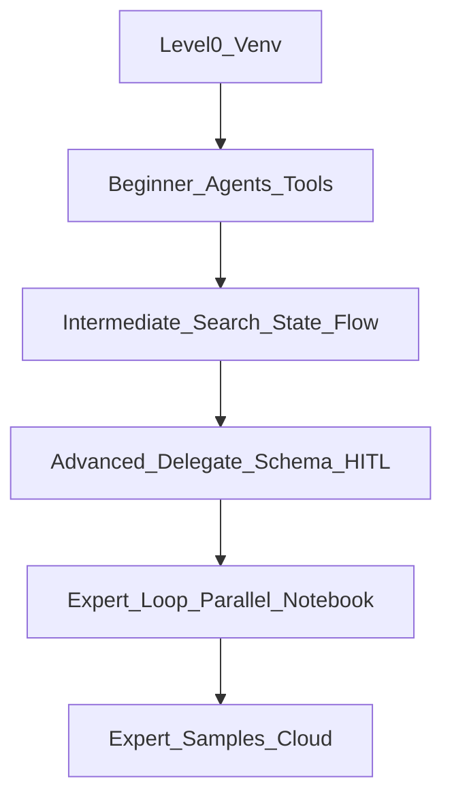

# ADK workshop curriculum (beginner → advanced)

Work through demos in order inside a **venv** (see [`README.md`](README.md)). Each folder under [`demos/`](demos/) runs with:

```bash
cd workshop
source .venv/bin/activate
cd demos
adk web .
```

## Level 0 — Environment (before any agent)

| Step | Topic | What you do |
|------|--------|-------------|
| 0.1 | Virtual env | `python3 -m venv .venv`, activate, `pip install -r requirements-workshop.txt` |
| 0.2 | Credentials | `export GOOGLE_API_KEY=...` (or Vertex per [ADK docs](https://google.github.io/adk-docs/)) |
| 0.3 | Smoke test | `pytest tests/ -v` from `workshop/` |

## Beginner — agents & tools

Concepts: `Agent`, instructions, first `adk web` session, function tools, tool schema from Python types.

| Order | Demo | Skill |
|-------|------|--------|
| B1 | [`hello_web`](demos/hello_web) | Plain LLM agent, no tools |
| B2 | [`calculator_basics`](demos/calculator_basics) | Two numeric tools; chaining |
| B3 | [`custom_tools`](demos/custom_tools) | Tools returning dicts / errors |

**Suggested time:** 30–45 minutes + exercises.

## Intermediate — grounding, memory, workflow

Concepts: built-in search, session state, retrieval-style tools, deterministic multi-step pipelines.

| Order | Demo | Skill |
|-------|------|--------|
| I1 | [`static_kb_rag`](demos/static_kb_rag) | “RAG-shaped” tool over static snippets |
| I2 | [`day_trip_search`](demos/day_trip_search) | **`google_search`** grounding |
| I3 | [`session_memory`](demos/session_memory) | **`ToolContext.state`** across turns |
| I4 | [`sequential_pipeline`](demos/sequential_pipeline) | **`SequentialAgent`** fixed order |

**Suggested time:** 45–60 minutes.

## Advanced — orchestration, structure, governance

Concepts: LLM-routed delegation, typed output, human approval before side effects.

| Order | Demo | Skill |
|-------|------|--------|
| A1 | [`multi_agent_coordinator`](demos/multi_agent_coordinator) | Coordinator + specialists (`sub_agents`) |
| A2 | [`structured_output`](demos/structured_output) | **`output_schema`** (Pydantic) for APIs/UI |
| A3 | [`hitl_sensitive_action`](demos/hitl_sensitive_action) | **`FunctionTool(..., require_confirmation=True)`** |

**Suggested time:** 45–60 minutes.

## Expert — workflow agents (router / loop / parallel)

Taught end-to-end in [`notebooks/ADK_Learning_tool_multi_agents.ipynb`](notebooks/ADK_Learning_tool_multi_agents.ipynb). See the unified path in [`COURSE_BEGINNER_TO_EXPERT.md`](COURSE_BEGINNER_TO_EXPERT.md).

| Order | Demo | Skill |
|-------|------|--------|
| E1 | [`loop_plan_refine`](demos/loop_plan_refine) | **`LoopAgent`**, critic ↔ refiner, **`exit_loop`**, `max_iterations` |
| E2 | [`parallel_research_synth`](demos/parallel_research_synth) | **`ParallelAgent`** + **`SequentialAgent`** synthesis; `output_key` fan-in |

**Suggested time:** 45–60 minutes (plus notebook deep-read).

## Expert extensions (study, not required for core workshop)

These map to **`adk-python/contributing/samples`** and cloud setup; keep as reading or a second lab day.

| Topic | Why it matters | Where to learn |
|--------|----------------|----------------|
| Vertex RAG corpus | Production retrieval | [`rag_agent`](https://github.com/google/adk-python/tree/main/contributing/samples/rag_agent) |
| Skills + SKILL.md | Packaged procedures | [`skills_agent`](https://github.com/google/adk-python/tree/main/contributing/samples/skills_agent) |
| Workflow / triage graphs | Mixed LLM + structure | [`workflow_triage`](https://github.com/google/adk-python/tree/main/contributing/samples/workflow_triage) |
| MCP servers | External tool ecosystems | [`tool_mcp_stdio_notion_config`](https://github.com/google/adk-python/tree/main/contributing/samples/tool_mcp_stdio_notion_config) |
| Agent evaluation | Regression testing | `adk eval` in [ADK README](https://github.com/google/adk-python/blob/main/README.md) |
| Deployment | Cloud Run / Agent Engine | [Deploy docs](https://google.github.io/adk-docs/deploy/) |

## Notebook track (parallel path)

| Resource | Use when |
|----------|----------|
| [`notebooks/ADK_Learning_tools_venv.ipynb`](notebooks/ADK_Learning_tools_venv.ipynb) | Same narrative as `ADK_Learning_tools.ipynb` on laptop |
| [`notebooks/ADK_Learning_tool_multi_agents.ipynb`](notebooks/ADK_Learning_tool_multi_agents.ipynb) | Router, `SequentialAgent`, **`LoopAgent`**, **`ParallelAgent`** (Colab-oriented; pair with workflow demos) |
| [`ADK_Learning_tools.ipynb`](ADK_Learning_tools.ipynb) | Colab / Vertex-focused original |

**Full course narrative (beginner → expert):** [`COURSE_BEGINNER_TO_EXPERT.md`](COURSE_BEGINNER_TO_EXPERT.md)

## Diagram

See [`ARCHITECTURE.md`](ARCHITECTURE.md) for runtime diagrams. Suggested learning path:


