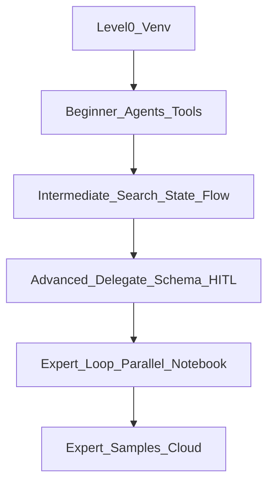

# ADK workshop curriculum (beginner → advanced)

Work through demos in order inside a **venv** (see [`README.md`](README.md)). Each folder under [`demos/`](demos/) runs with:

```bash
cd workshop
source .venv/bin/activate
cd demos
adk web .
```

## Level 0 — Environment (before any agent)

| Step | Topic       | What you do                                                                                |
| ---- | ----------- | ------------------------------------------------------------------------------------------ |
| 0.1  | Virtual env | `python3 -m venv .venv`, activate, `pip install -r requirements-workshop.txt`              |
| 0.2  | Credentials | `export GOOGLE_API_KEY=...` (or Vertex per [ADK docs](https://google.github.io/adk-docs/)) |
| 0.3  | Smoke test  | `pytest tests/ -v` from `workshop/`                                                        |

## Beginner — agents & tools

Concepts: `Agent`, instructions, first `adk web` session, function tools, tool schema from Python types.

| Order | Demo                                           | Skill                          |
| ----- | ---------------------------------------------- | ------------------------------ |
| B1    | [`01-hello_web`](demos/01-hello_web)                 | Plain LLM agent, no tools      |
| B2    | [`02-calculator_basics`](demos/02-calculator_basics) | Two numeric tools; chaining    |
| B3    | [`03-custom_tools`](demos/03-custom_tools)           | Tools returning dicts / errors |

**Suggested time:** 30–45 minutes + exercises.

## Intermediate — grounding, memory, workflow

Concepts: built-in search, session state, retrieval-style tools, deterministic multi-step pipelines.

| Order | Demo                                                       | Skill                                              |
| ----- | ---------------------------------------------------------- | -------------------------------------------------- |
| I1    | [`04-static_kb_rag`](demos/04-static_kb_rag)                     | “RAG-shaped” tool over static snippets             |
| I2    | [`05-day_trip_search`](demos/05-day_trip_search)                 | **`google_search`** grounding                      |
| I3    | [`06-session_memory`](demos/06-session_memory)                   | **`ToolContext.state`** across turns               |
| I4    | [`07-sequential_pipeline`](demos/07-sequential_pipeline)         | **`SequentialAgent`** fixed order                  |
| I5    | [`08-sequential_state_shared`](demos/08-sequential_state_shared) | **`output_key`** + **`{placeholders}`** in a chain |
| I6    | [`09-live_weather_nws`](demos/09-live_weather_nws)               | Real **HTTP** function tool (US weather)           |
| I7    | [`10-agent_config_yaml`](demos/10-agent_config_yaml)             | **YAML** agent config + shared `tools.py`          |

**Suggested time:** 45–60 minutes.

## Advanced — orchestration, structure, governance

Concepts: LLM-routed delegation, typed output, human approval before side effects.

| Order | Demo                                                             | Skill                                              |
| ----- | ---------------------------------------------------------------- | -------------------------------------------------- |
| A1    | [`11-multi_agent_coordinator`](demos/11-multi_agent_coordinator)       | Coordinator + specialists (`sub_agents`)           |
| A2    | [`12-agent_as_tool_orchestrator`](demos/12-agent_as_tool_orchestrator) | **`AgentTool`** (agent-as-a-tool)                  |
| A3    | [`13-structured_output`](demos/13-structured_output)                   | **`output_schema`** (Pydantic) for APIs/UI         |
| A4    | [`14-hitl_sensitive_action`](demos/14-hitl_sensitive_action)           | **`FunctionTool(..., require_confirmation=True)`** |

**Suggested time:** 45–60 minutes.

## Expert — workflow agents (router / loop / parallel)

Taught end-to-end in [`notebooks/ADK_Learning_tool_multi_agents.ipynb`](notebooks/ADK_Learning_tool_multi_agents.ipynb). See the unified path in [`COURSE_BEGINNER_TO_EXPERT.md`](COURSE_BEGINNER_TO_EXPERT.md).

| Order | Demo                                                               | Skill                                                                      |
| ----- | ------------------------------------------------------------------ | -------------------------------------------------------------------------- |
| E1    | [`15-structured_persona_research`](demos/15-structured_persona_research) | **`output_schema`** with tools + nested specialist                         |
| E2    | [`16-loop_plan_refine`](demos/16-loop_plan_refine)                       | **`LoopAgent`**, critic ↔ refiner, **`exit_loop`**, `max_iterations`       |
| E3    | [`17-parallel_research_synth`](demos/17-parallel_research_synth)         | **`ParallelAgent`** + **`SequentialAgent`** synthesis; `output_key` fan-in |

**Suggested time:** 45–60 minutes (plus notebook deep-read).

## Expert extensions (study, not required for core workshop)

These map to **`adk-python/contributing/samples`** and cloud setup; keep as reading or a second lab day.

| Topic                    | Why it matters           | Where to learn                                                                                                                                                                            |
| ------------------------ | ------------------------ | ----------------------------------------------------------------------------------------------------------------------------------------------------------------------------------------- |
| Vertex RAG corpus        | Production retrieval     | [`rag_agent`](https://github.com/google/adk-python/tree/main/contributing/samples/rag_agent)                                                                                              |
| Skills + SKILL.md        | Packaged procedures      | [`skills_agent`](https://github.com/google/adk-python/tree/main/contributing/samples/skills_agent)                                                                                        |
| Workflow / triage graphs | Mixed LLM + structure    | [`workflow_triage`](https://github.com/google/adk-python/tree/main/contributing/samples/workflow_triage)                                                                                  |
| MCP / OpenAPI            | External tool ecosystems | Workshop: [`INTEGRATIONS.md`](INTEGRATIONS.md); sample [`tool_mcp_stdio_notion_config`](https://github.com/google/adk-python/tree/main/contributing/samples/tool_mcp_stdio_notion_config) |
| Agent evaluation         | Regression testing       | `adk eval` in [ADK README](https://github.com/google/adk-python/blob/main/README.md)                                                                                                      |
| Deployment               | Cloud Run / Agent Engine | [Deploy docs](https://google.github.io/adk-docs/deploy/)                                                                                                                                  |

## Notebook track (parallel path)

| Resource                                                                                           | Use when                                                                                                   |
| -------------------------------------------------------------------------------------------------- | ---------------------------------------------------------------------------------------------------------- |
| [`notebooks/ADK_Learning_tools_venv.ipynb`](notebooks/ADK_Learning_tools_venv.ipynb)               | Same narrative as `ADK_Learning_tools.ipynb` on laptop                                                     |
| [`notebooks/ADK_Learning_tool_multi_agents.ipynb`](notebooks/ADK_Learning_tool_multi_agents.ipynb) | Router, `SequentialAgent`, **`LoopAgent`**, **`ParallelAgent`** (Colab-oriented; pair with workflow demos) |
| [`ADK_Learning_tools.ipynb`](ADK_Learning_tools.ipynb)                                             | Colab / Vertex-focused original                                                                            |

**Full course narrative (beginner → expert):** [`COURSE_BEGINNER_TO_EXPERT.md`](COURSE_BEGINNER_TO_EXPERT.md)

## Diagram

See [`ARCHITECTURE.md`](ARCHITECTURE.md) for runtime diagrams. Suggested learning path:


