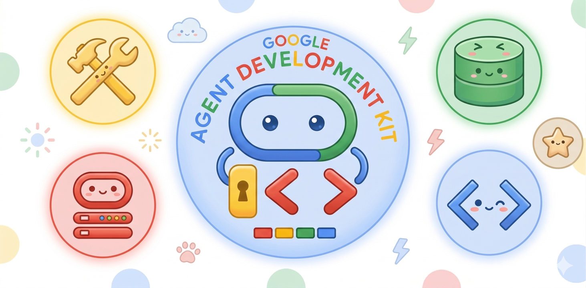

<div align="center">
  
</div>

# Google ADK workshop

Hands-on materials for presenting the [Google Agent Development Kit (ADK)](https://google.github.io/adk-docs/) with a **local Python virtual environment**. For the original Colab-oriented lab, see [`ADK_Learning_tools.ipynb`](ADK_Learning_tools.ipynb). For the same learning arc on your laptop, see [`notebooks/ADK_Learning_tools_venv.ipynb`](notebooks/ADK_Learning_tools_venv.ipynb) (open from repo root with path `workshop/notebooks/...`).
**Multi-agent orchestration** (router, `SequentialAgent`, `LoopAgent`, `ParallelAgent`): [`notebooks/ADK_Learning_tool_multi_agents.ipynb`](notebooks/ADK_Learning_tool_multi_agents.ipynb).

**Official companion course:** [ADK Crash Course — From Beginner to Expert](https://codelabs.developers.google.com/onramp/instructions#0) (Google Codelabs: GCP setup, Colab notebooks on tools/memory and multi-agents, Router / Sequential / Loop / Parallel patterns, and ADK Web appendices).

## Prerequisites

- Python **3.10+**
- A **Google AI Studio API key** ([get a key](https://ai.google.dev/gemini-api/docs/api-key)) **or** Vertex AI credentials (see [ADK authentication](https://google.github.io/adk-docs/))
- Optional: Google Cloud project if you use Vertex-only tools

## Virtual environment (use for every demo)

From the repository root:

```bash
cd workshop
python3 -m venv .venv
source .venv/bin/activate
```

On Windows:

```bash
cd workshop
python -m venv .venv
.venv\Scripts\activate
```

Install dependencies:

```bash
pip install -U pip
pip install -r requirements-workshop.txt
```

### Environment variables

| Mode                           | Typical variables                                                                    | Notes                                                                                                 |
| ------------------------------ | ------------------------------------------------------------------------------------ | ----------------------------------------------------------------------------------------------------- |
| **Gemini API (Developer API)** | `export GOOGLE_API_KEY="your-key"`                                                   | Easiest for workshops; used by demos by default.                                                      |
| **Vertex AI**                  | `GOOGLE_CLOUD_PROJECT`, `GOOGLE_CLOUD_LOCATION`, and Application Default Credentials | Use when demos or your key policy require Vertex. See [ADK docs](https://google.github.io/adk-docs/). |

Optional: copy [`.env.example`](.env.example) to `workshop/.env` and fill in values. ADK Web loads per-agent `.env` when present. Never commit `.env`.

### Jupyter kernel (optional)

```bash
python -m ipykernel install --user --name=adk-workshop --display-name="ADK Workshop"
```

Open the venv notebook and choose this kernel.

## Curriculum (beginner → advanced)

Structured learning paths, timing, and “what’s next” for expert topics are in [`CURRICULUM.md`](CURRICULUM.md).
**Unified day-long path** (both notebooks + all demo tiers): [`COURSE_BEGINNER_TO_EXPERT.md`](COURSE_BEGINNER_TO_EXPERT.md).

**Extras:** checkpoint list [`demos/CHECKPOINTS.md`](demos/CHECKPOINTS.md); deeper topics [`LEARNING_DEEP_DIVE.md`](LEARNING_DEEP_DIVE.md); evaluation sample + schema notes [`eval/`](eval/) and [`EVAL.md`](EVAL.md); [`DEPLOY.md`](DEPLOY.md); learner checklist [`RUBRIC.md`](RUBRIC.md); MCP/OpenAPI notes [`INTEGRATIONS.md`](INTEGRATIONS.md).

## Runnable demos (`demos/`)

Each folder is one **ADK Web** app. Most define `root_agent` in `agent.py`; **`10-agent_config_yaml`** uses `root_agent.yaml` + `tools.py` instead. From `workshop`, with the venv activated:

```bash
cd demos
adk web .
```

Then pick an app in the UI (e.g. `01-hello_web`, `05-day_trip_search`).

| Folder                                                                         | Level        | What it shows                                        | Related upstream sample                                                                                                              |
| ------------------------------------------------------------------------------ | ------------ | ---------------------------------------------------- | ------------------------------------------------------------------------------------------------------------------------------------ |
| [`demos/01-hello_web`](demos/01-hello_web)                                     | Beginner     | Minimal agent; first `adk web` run                   | [`quickstart`](https://github.com/google/adk-python/tree/main/contributing/samples/quickstart)                                       |
| [`demos/02-calculator_basics`](demos/02-calculator_basics)                     | Beginner     | Simple numeric tools                                 | [`hello_world`](https://github.com/google/adk-python/tree/main/contributing/samples/hello_world) (patterns)                          |
| [`demos/03-custom_tools`](demos/03-custom_tools)                               | Beginner     | Function tools (weather/time, errors)                | [`quickstart`](https://github.com/google/adk-python/tree/main/contributing/samples/quickstart)                                       |
| [`demos/04-static_kb_rag`](demos/04-static_kb_rag)                             | Intermediate | In-memory “RAG-shaped” retrieval                     | [`rag_agent`](https://github.com/google/adk-python/tree/main/contributing/samples/rag_agent) (production RAG)                        |
| [`demos/07-sequential_pipeline`](demos/07-sequential_pipeline)                 | Intermediate | `SequentialAgent` (outline → expand)                 | [`simple_sequential_agent`](https://github.com/google/adk-python/tree/main/contributing/samples/simple_sequential_agent)             |
| [`demos/08-sequential_state_shared`](demos/08-sequential_state_shared)         | Intermediate | `output_key` + `{placeholder}` between steps         | [`ADK_Learning_tool_multi_agents.ipynb`](notebooks/ADK_Learning_tool_multi_agents.ipynb)                                             |
| [`demos/05-day_trip_search`](demos/05-day_trip_search)                         | Intermediate | Grounded itinerary with `google_search`              | [`ADK_Learning_tools.ipynb`](ADK_Learning_tools.ipynb) Part 1                                                                        |
| [`demos/06-session_memory`](demos/06-session_memory)                           | Intermediate | `ToolContext.state` across turns                     | [`session_state_agent`](https://github.com/google/adk-python/tree/main/contributing/samples/session_state_agent)                     |
| [`demos/09-live_weather_nws`](demos/09-live_weather_nws)                       | Intermediate | Real HTTP tool (`api.weather.gov`, US)               | [`ADK_Learning_tools.ipynb`](ADK_Learning_tools.ipynb) (NWS-style labs)                                                              |
| [`demos/11-multi_agent_coordinator`](demos/11-multi_agent_coordinator)         | Advanced     | Coordinator + specialist sub-agents                  | [`hello_world_ma`](https://github.com/google/adk-python/tree/main/contributing/samples/hello_world_ma)                               |
| [`demos/12-agent_as_tool_orchestrator`](demos/12-agent_as_tool_orchestrator)   | Advanced     | `AgentTool` — sub-agent invoked as a tool            | [`tool_agent_tool_config`](https://github.com/google/adk-python/tree/main/contributing/samples/tool_agent_tool_config)               |
| [`demos/13-structured_output`](demos/13-structured_output)                     | Advanced     | Pydantic `output_schema`                             | [`output_schema_with_tools`](https://github.com/google/adk-python/tree/main/contributing/samples/output_schema_with_tools)           |
| [`demos/15-structured_persona_research`](demos/15-structured_persona_research) | Expert       | `output_schema` + `AgentTool` specialist (no Search) | [`output_schema_with_tools`](https://github.com/google/adk-python/blob/main/contributing/samples/output_schema_with_tools/agent.py)  |
| [`demos/10-agent_config_yaml`](demos/10-agent_config_yaml)                     | Intermediate | Agent from `root_agent.yaml`                         | [`tool_functions_config`](https://github.com/google/adk-python/tree/main/contributing/samples/tool_functions_config)                 |
| [`demos/14-hitl_sensitive_action`](demos/14-hitl_sensitive_action)             | Advanced     | Tool confirmation (`require_confirmation`)           | [`tool_human_in_the_loop_config`](https://github.com/google/adk-python/tree/main/contributing/samples/tool_human_in_the_loop_config) |
| [`demos/16-loop_plan_refine`](demos/16-loop_plan_refine)                       | Expert       | `LoopAgent` + `exit_loop` (plan / critic / refiner)  | [`ADK_Learning_tool_multi_agents.ipynb`](notebooks/ADK_Learning_tool_multi_agents.ipynb)                                             |
| [`demos/17-parallel_research_synth`](demos/17-parallel_research_synth)         | Expert       | `ParallelAgent` → synthesis (`output_key` merge)     | same notebook                                                                                                                        |

**Note:** `google_search` may require an eligible Gemini model and account; if it fails in the room, use `01-hello_web` or `03-custom_tools` as fallback (see [`PRESENTER_GUIDE.md`](PRESENTER_GUIDE.md)).

## Verify demos locally

With venv activated, from `workshop`:

```bash
pip install -r requirements-workshop.txt
python scripts/check_api_key_leaks.py
pytest tests/ -v
```

**CI:** [`.github/workflows/ci.yml`](.github/workflows/ci.yml) runs the leak check and `pytest` on push/PR when `workshop/` is the repository root.

## Learning diagrams

See [`ARCHITECTURE.md`](ARCHITECTURE.md) for Mermaid diagrams (agent/runner/session/tool flow).

## Presenter script

See [`PRESENTER_GUIDE.md`](PRESENTER_GUIDE.md) for timing, fallbacks, and links to [adk-docs](https://google.github.io/adk-docs/) and [adk-samples](https://github.com/google/adk-samples).

## Reference

This workshop material was developed using Google’s official ADK resources as reference, including the [Agent Development Kit documentation](https://google.github.io/adk-docs/), the open-source [adk-python](https://github.com/google/adk-python) project (and its `contributing/samples`), the [ADK Crash Course codelab](https://codelabs.developers.google.com/onramp/instructions#0), and the accompanying learning notebooks in this folder. It is not an official Google product.
